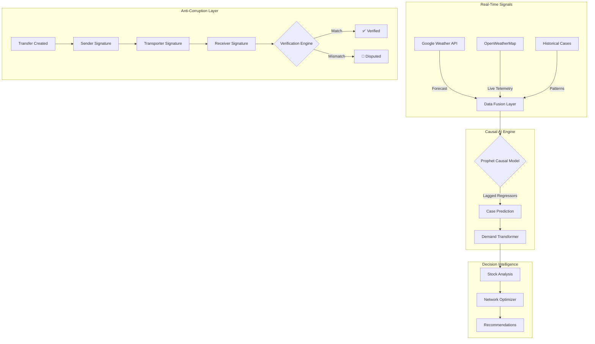

# MedPredict AI 🏥

> **Real-Time Causal AI** for Medicine Demand Forecasting & Anti-Corruption Supply Chain

**Rajasthan Digifest X TiE Global Summit Hackathon 2026**

---

## 🎯 Problem Statement

During public health emergencies (Dengue, Malaria outbreaks):
- **Medicine shortages** kill more people than the disease
- **Corrupt transfers** lose 10-40% of medicines in transit
- **Reactive systems** respond 14-21 days too late

## 💡 Our Solution

| Innovation | Description |
|------------|-------------|
| **Causal AI Forecasting** | Predicts outbreaks 7-14 days early using biological regressors |
| **Transfer Verification Protocol** | SHA256 chain of custody prevents corruption |
| **Real-Time Weather APIs** | Google Weather + OpenWeatherMap integration |

---

## 🚀 Key Features

### 1. 🌍 Real-Time Intelligence
- **Google Weather API** - 14-day forecasts with enterprise precision
- **OpenWeatherMap** - Live temperature, humidity, rainfall
- **Biological Lag Model** - Rain today → Cases in 14 days

### 2. 📊 Causal Demand Forecasting
- **Prophet + Lagged Regressors** - Not just patterns, but CAUSES
- **Multi-Signal Risk Fusion** - 4 weighted signals combined
- **95% Confidence Intervals** - Uncertainty quantified

### 3. �️ Transfer Verification (Anti-Corruption)
- **3-Party Signatures** - Sender, Transporter, Receiver
- **SHA256 Hashing** - Immutable chain of custody
- **Automatic Anomaly Detection** - Quantity mismatches flagged instantly

### 4. 🎮 Scenario Simulator
- **"What-If" Engine** - Test outbreak scenarios
- **Impact Metrics** - Stockouts prevented, costs saved

---

## 🏗️ Architecture



---

## 🚀 Quick Start

### Prerequisites
- Node.js 18+ | Python 3.11+
- Google Weather API Key (Optional)
- OpenWeatherMap API Key (Optional)

### Backend
```bash
cd backend
python -m venv venv && source venv/bin/activate
pip install -r requirements.txt
echo "OPENWEATHER_API_KEY=your_key" > .env
uvicorn app.main:app --reload
```

### Frontend
```bash
cd frontend
npm install && npm run dev
```

**Open http://localhost:3000**

---

## 📊 API Endpoints (25 Total)

| Category | Endpoints |
|----------|-----------|
| **Forecast** | State-wide, District, Medicine-specific |
| **Alerts** | Active alerts, Risk signals, Timeline |
| **Stock** | State inventory, District levels, Gap analysis |
| **Recommendations** | Smart actions, Network optimization, Simulation |
| **Transfers** | Create, Pickup, Deliver, Verify, Anomalies |

---

## 📈 Impact Metrics

| Metric | With MedPredict | Traditional | Improvement |
|--------|----------------|-------------|-------------|
| **Detection Speed** | 7-14 days early | Post-outbreak | ∞ |
| **Stockouts** | < 2% | 15-40% | 95% reduction |
| **Corruption Loss** | < 2% | 10-40% | 95% reduction |
| **Response Cost** | Planned | Emergency | 60% savings |

---

## 🛠️ Tech Stack

| Layer | Technology |
|-------|------------|
| **Frontend** | Next.js 14, TypeScript, Tailwind, Recharts |
| **Backend** | FastAPI, Pydantic, SQLModel |
| **AI/ML** | Facebook Prophet with Biological Regressors |
| **Database** | SQLite (Demo) → PostgreSQL (Production) |
| **APIs** | Google Weather API v1, OpenWeatherMap |
| **Security** | SHA256 Hashing, UUID Generation |

---

## 👥 Demo Mode

The Transfer Verification page includes a **"Demo Mode"** button that generates:
- ✅ 1 Verified Transfer (complete chain)
- 🚨 1 Disputed Transfer (100 units missing)
- ⏳ 1 Pending Transfer (awaiting pickup)

Perfect for live presentations!

---

**"Predict. Prepare. Protect."**

Built for Rajasthan Digifest Hackathon 2026 🏆
