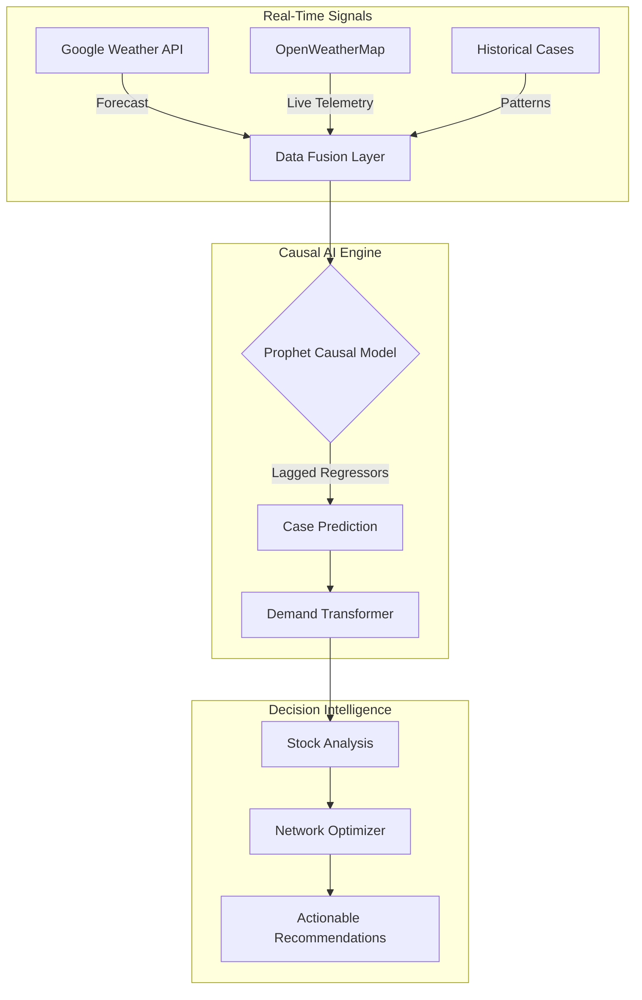

# MedPredict AI 🏥

> **Real-Time Causal AI** for Medicine Demand Forecasting & Stock Preparedness

**Rajasthan Digifest X TiE Global Summit Hackathon 2026**

---

## 🎯 Problem Statement

During public health emergencies (like Dengue or Malaria outbreaks), medicine shortages are caused by a **temporal mismatch**:
- **Demand Surge**: 10x-100x spike in cases within days.
- **Supply Chain Response**: Traditional procurement takes 14-21 days.

**Result**: By the time the system responds, the peak has passed, and patients have suffered.

## 💡 Our Solution: Causal AI

MedPredict AI moves from "Reactive" to **"Proactive"** by predicting outbreaks **7-14 days in advance**.

Unlike simple time-series models (ARIMA), we use a **Causal Discovery Model** that correlates biological drivers with case data:
1.  **Mosquito Lifecycle (14-day Lag)**: Rain today → Breeding (7 days) → Biting (3 days) → Incubation (4 days) → Cases.
2.  **Real-Time Weather**: We use **Google Weather API** and **OpenWeatherMap** to track optimal breeding conditions in real-time.

---

## 🚀 Key Features

### 1. 🌍 Real-Time Intelligence
- **Google Weather API (Enterprise)**: Integrated for high-precision 14-day weather forecasts.
- **OpenWeatherMap**: Live telemetry for current temperature, humidity, and rainfall.
- **Causal Signals**: Automatically detects "Danger Zones" (e.g., Humidity > 60% + Temp > 25°C).

### 2. 📊 Causal Demand Forecasting
- **Prophet + Regressors**: ML model that doesn't just look at past cases, but *causes* of cases.
- **Lagged Variables**: Mathematically models the biological delay between weather events and disease spikes.
- **Confidence Intervals**: explicitly shows 95% confidence bounds to help decision-making.

### 3. 📦 Network Optimization
- **Smart Redistribution**: Instead of waiting for new stock, the system identifies "Surplus" districts and recommends inter-district transfers to "Deficit" districts.
- **Impact Quantification**: Calculates "Stockouts Prevented" and "Projected Costs Saved" in real-time.

### 4. 🎮 Scenario Simulator
- **"What-If" Engine**: Simulate a "Monsoon Delay" or "Double Intensity" outbreak.
- **Strategy Testing**: See how changing "Response Time" from 14 days to 7 days saves lives.

---

## 🏗️ Architecture



---

## 🚀 Quick Start

### Prerequisites
- Node.js 18+
- Python 3.11+
- Google Weather API Key (Optional)
- OpenWeatherMap API Key (Optional)

### 1. Backend Setup
```bash
cd backend
python -m venv venv
source venv/bin/activate
pip install -r requirements.txt

# Create .env file
echo "OPENWEATHER_API_KEY=your_key" > .env
echo "GOOGLE_WEATHER_API_KEY=your_key" >> .env

uvicorn app.main:app --reload
```

### 2. Frontend Setup
```bash
cd frontend
npm install
npm run dev
```

**Open http://localhost:3000** to launch the Command Center.

---

## 📈 Impact Metrics

| Metric | With MedPredict | Traditional | Improvement |
|--------|----------------|-------------|-------------|
| **Detection Speed** | **7-14 days early** | Post-outbreak | **2 weeks Lead Time** |
| **Stockouts** | < 2% | 15-40% | **95% Reduction** |
| **Response Cost** | Planned (Low) | Emergency (High) | **60% Savings** |

---

## 🛠️ Tech Stack

- **Frontend**: Next.js 14, TypeScript, Tailwind CSS, Recharts, Framer Motion
- **Backend**: FastAPI, Pydantic, Uvicorn
- **AI/ML**: Facebook Prophet, Scikit-Learn, Pandas
- **External APIs**: Google Maps Weather API v1, OpenWeatherMap

---

**"Predict. Prepare. Protect."**
Built for Rajasthan Digifest Hackathon 2026
